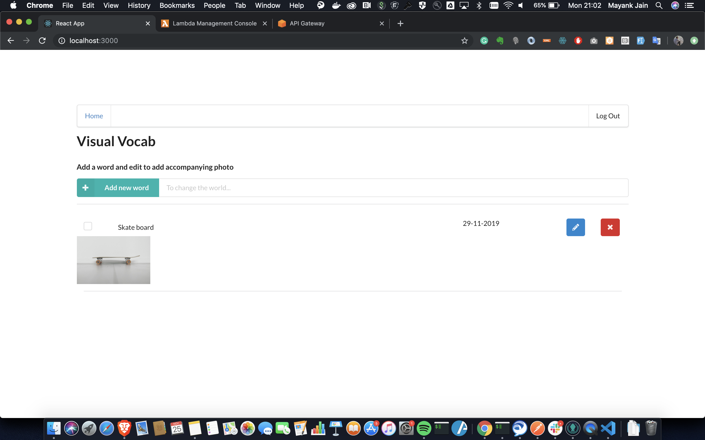

# Serverless

A serverless visual vocab app

# Functionality of the application

This appliation will allow to create/remove/update/get visual vocab words.

# Functions to be implemented

Following functions are configured in `serverless.yml` file:

* `Auth` - custom authorizer for API Gateway.
* `GetVocabs` - Get all the words 
* `CreateVocab` - create a new word
* `UpdateVocab` - update a word with a image
* `DeleteVocab` - delete a word
* `GenerateUploadUrl` - returns a presigned url that can be used to upload an attachment file for a word


# Frontend

The `client` folder contains a web application that can use the API developed in this project


# How to run the application

## Backend

To deploy an application run the following commands:

```
cd backend
npm install
sls deploy -v
```

## Frontend

To run a client application first edit the `client/src/config.ts` file to set correct parameters. And then run the following commands

```
cd client
npm install
npm run start
```

This should start a development server with the React application that will interact with the serverless TODO application.


# Sample screenshot



